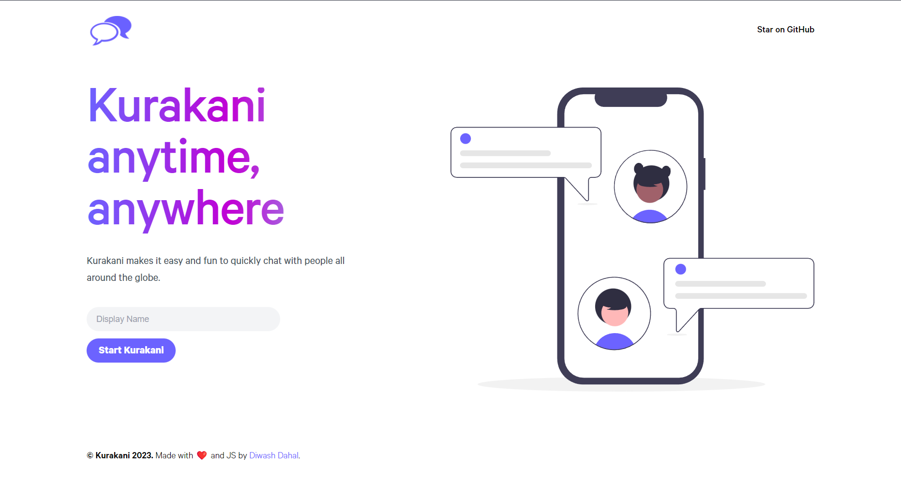

<br/>
<p align="center">
  <a href="https://kura-kani.vercel.app">
    
  </a>

  <h3 align="center">Kurakani</h3>

  <p align="center">
    An easy platform to quickly chat with people all around the globe
    <br/>
    <br/>
  </p>
</p>

## Table Of Contents

- [About the Project](#about-the-project)
- [Built With](#built-with)
- [Getting Started](#getting-started)
  - [Prerequisites](#prerequisites)
  - [Installation](#installation)
- [Contributing](#contributing)

## About The Project



"Kurakani" is a sleek and intuitive real-time chat application built with Next.js and Express. It offers users a seamless and engaging platform to connect with friends, family, and colleagues. With its modern design and responsive interface, "Kurakani" ensures an enjoyable chatting experience across devices. Stay connected, express yourself with emojis and stickers, and enjoy secure and instant communication with "Kurakani".

## Built With

- [React](https://react.dev/)
- [Next.js](https://nextjs.org/)
- [Express](https://expressjs.com/)
- [Socket.io](https://www.npmjs.com/package/socket.io)

## Getting Started

### Prerequisites

Node JS

### Installation

1. Clone the repo

```sh
git clone https://github.com/diwash007/kurakani.git

```

2. Set the required environment variables as given in env examples

3. Install NPM packages for frontend and start server

```sh
cd frontend
npm install
npm run dev
```

4. Install NPM packages for backend and start server

```sh
cd backend
npm install
npm start
```

## Contributing

1. Fork the Project
2. Create your Feature Branch (`git checkout -b feature/AmazingFeature`)
3. Commit your Changes (`git commit -m 'Add some AmazingFeature'`)
4. Push to the Branch (`git push origin feature/AmazingFeature`)
5. Open a Pull Request
